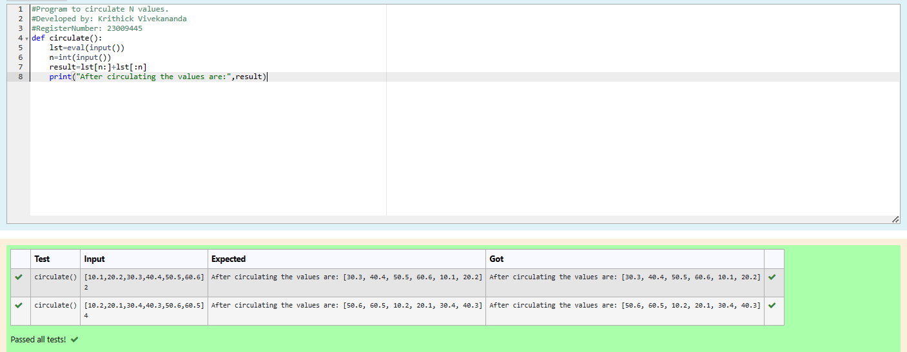

# Circulate-the-values-of-N-variables
## Aim:
To write a python program to circulate the n variables using function concept
## Equipment’s required:
PC
Anaconda - Python 3.7
## Algorithm: 
### Step 1: 
Define a function circulate().
### Step 2: 
Get the input from the user using eval() function.
### Step 3: 
Get the value from the user for the number of rotation.
### Step 4: 
Using the slicing concept rotate the list.

### Step 5: 
Print the circulated list as per the given format.
### Step 6: 
End the Program
## Program:
```python
#Program to circulate N values.
#Developed by: Krithick Vivekananda
#RegisterNumber: 23009445
def circulate():
    lst=eval(input())
    n=int(input())
    result=lst[n:]+lst[:n]
    print("After circulating the values are:",result)
```

## Output:



## Result:
Thus the program to circulate the N values is written and verified using python programming.
